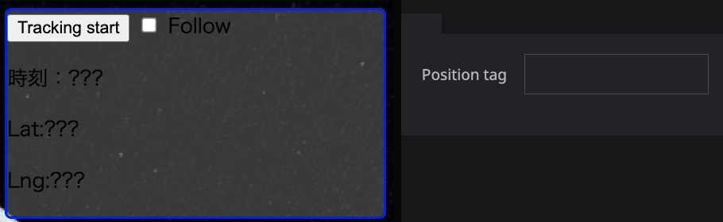

# My position plugin

Moves the map to the current location obtained by GPS.
If any tags are set, the layer will be displayed at the current location.

GPSで取得した現在地にマップを移動します。
任意のタグを設定していると、そのレイヤーを現在地に表示します。

## How to use
### My position widget
- Press `Get location` once to get the current location and move the map to that location.
-  If there is a layer with the tag entered in the Position tag, it will move the layer to the current location.

  
### Tracking Widget
- Pressing `Tracking start` will continue to acquire location information at one second intervals.
- Press `Tracking stop` to end tracking.
- If you check `Follow` while tracking, the map will move automatically.
- If there is a layer with the tag entered in the Position tag, it will move the layer to the current location.

## 使い方
### My position widget
- `Get location`を押すと1度だけ現在地を取得して、その場所にマップが移動します。
- Position tagに入力したタグを設定しているレイヤーがあれば、そのレイヤーを現在地に移動させます。

### Tracking Widget
- `Tracking start`を押すと、1秒間隔で位置情報を取得し続けます。
- `Tracking stop`を押すと、トラッキングを終わります。
- トラッキング中に`Follow`にチェックを入れると、地図を自動で移動します。
- Position tagに入力したタグを設定しているレイヤーがあれば、そのレイヤーを現在地に移動させます。
